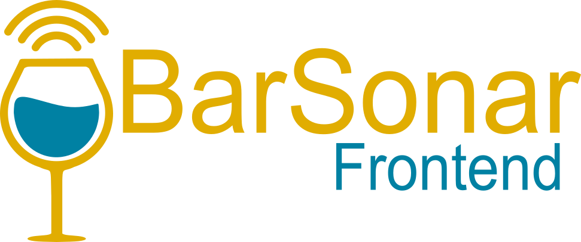

## <span style="color:purple">Tartalomjegyzék</span>
- [Tartalomjegyzék](#tartalomjegyzék)
- [Stack](#stack)
- [Előfeltételek](#előfeltételek)
- [Telepítés](#telepítés)
    - [1. Klónozás és függőségek telepítése](#1-klónozás-és-függőségek-telepítése)
    - [2. Környezeti változók](#2-környezeti-változók)
- [Futtatás Dockerben](#futtatás-dockerben)
- [Futtatás](#futtatás)
- [Backend kapcsolat](#backend-kapcsolat)
- [Tesztelés](#tesztelés)
- [Hozzájárulás](#hozzájárulás)

---

## <span style="color:purple">Stack</span>


---

## <span style="color:purple">Előfeltételek</span>

A projekt futtatásához szükséges:

- **<span style="color:red">Node.js</span>**
- **<span style="color:red">npm</span>**
- **<span style="color: #1D63ED">Docker Desktop</span>**, ha csak futtatni szeretnéd a programot, nem fejleszteni
- **<span style="color:red">[BarSonar Backend](https://github.com/jaaajaaaja/VizsgaRemek_Backend)</span>** – a frontend a backend API-t használja, ezért a backend futnia kell

---

## <span style="color:purple">Telepítés</span>

#### 1. Klónozás és függőségek telepítése

```bash
# Klónozd a repository-t
git clone <repository-url>

# Lépj be a frontend mappába
cd barsonar-frontend

# Telepítsd a függőségeket (node_modules mappa)
npm install
```

#### 2. Környezeti változók

Nevezd át a projekt gyökerében lévő `.env.example` fájlt `.env`-re és állítsd be a következőképpen:

```env
VITE_API_BASE_URL=/api
VITE_PROXY_TARGET=http://localhost:3000
VITE_WORKER_URL="https://projekt-nev.felhasznalonev.workers.dev"
VITE_GOOGLE_MAPS_API_KEY=Your-Google-Maps-API-Key-Goes-Here
```

**Megjegyzések:**

- `VITE_API_BASE_URL` – a backend API alapcímére mutat (fejlesztéskor gyakran `/api`, amikor a Vite proxy használatban van)
- `VITE_PROXY_TARGET` – a backend szerver címe, amit a Vite fejlesztési szerver proxy-z (általában `http://localhost:3000`)
- `VITE_WORKER_URL` – a Cloudflare Worker URL-je a valós idejű chathez
- `VITE_GOOGLE_MAPS_API_KEY` – Google Maps API kulcs a térképhez és helyrészletekhez

---

## <span style="color:purple">Futtatás Dockerben</span>

Ha nem szeretnéd fejleszteni az alkalmazást, csak futtatni, elég, ha letöltöd a Docker-t, beírsz két parancsot, és már fut is az alkalmazás. A kódot attól még le kell tölteni a gépedre.

Ha változtatni szeretnél a környezeti változókon, a `compose.yaml` fájlban megteheted.

---

#### Fontos!
Ha Windows operációs rendszeren akarod futtatni a konténert CMD-ből (parancssorból) add ki a következő utasításokat NE PowerShell-ből, különben nem fogja az ```docker-entrypoint.sh``` fájlt megtalálni. 
Azonban ha egyszer elindítottad CMD-ből utána el tudod indítani PowerShell-ből is.

---
```bash
docker build -t barsonar-frontend --no-cache .
docker compose up
```

---

## <span style="color:purple">Futtatás</span>

```bash
npm run dev
```

Az alkalmazás a
- `http://localhost:5173`
- `https://localhost:5173` (SSL támogatással)

címeken lesz elérhető.

**Build production verzióhoz:**

```bash
npm run build
npm run preview   # Előnézet a production buildről
```

---

## <span style="color:purple">Backend kapcsolat</span>

A frontend a BarSonar backend API-t használja. Fejlesztés közben:

1. Indítsd el a backendet (általában `http://localhost:3000`-en)
2. A Vite proxy automatikusan a `VITE_PROXY_TARGET` címen lévő backendre irányítja az API hívásokat
3. Ha a backend más porton vagy URL-en fut, módosítsd a `.env` fájlban a `VITE_PROXY_TARGET` és `VITE_API_BASE_URL` értékeket

---


## <span style="color:purple">Hozzájárulás</span>

**A projekt fejlesztése során kérjük, hogy:**

1. Fork-old a repository-t
2. Hozz létre egy feature branch-et (`git checkout -b feature/uj-funkcio`)
3. Commit-old a változtatásaidat (`git commit -m 'Hozzáadva: új funkció'`)
4. Push-old a branch-et (`git push origin feature/uj-funkcio`)
5. Nyiss egy Pull Request-et

---

**Készítette:** BarSonar fejlesztői csapat  

**Verzió:** 0.0.01 

**Utolsó frissítés:** 2026
